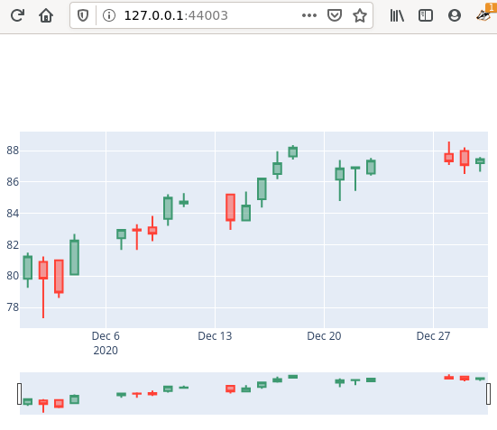

[](https://codecov.io/gh/davips/rndqts)

# rndqts
Random stock market quotes


## Installation
### from package
```bash
# Set up a virtualenv. 
python3 -m venv venv
source venv/bin/activate

# Install from PyPI
pip install rndqts
```

### from source
```bash
cd my-project
git clone https://github.com/davips/rndqts ../rndqts
pip install -e ../rndqts
```

## Examples

<<real>>

<<rnd>>

<<ascsv>>

<<plot>>
<p></p>


## Features / TODO

* [x] Fetch from yahoo
* [x] Automatic local caching
* [x] Slicing
* [x] Plot candle sticks
* [x] Random quotes
       * [x] Ticker 'pseudo' is an option to generate data without real quotes dependence (good for tests)
       * [ ] Explicit real quotes to sample from ('rnd-MSFT,APPL')
       * [ ] 'n' argument fetches lazily within date interval 
       * [ ] EXAMPLETICKER prepackaged as file to allow more comprehensive doctests


