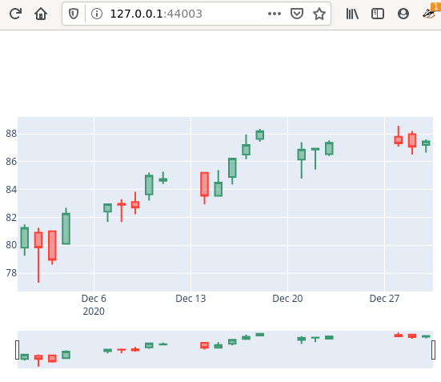

[](https://codecov.io/gh/davips/rndqts)

# rndqts
Random stock market quotes


## Installation
### from package
```bash
# Set up a virtualenv. 
python3 -m venv venv
source venv/bin/activate

# Install from PyPI
pip install rndqts
```

### from source
```bash
cd my-project
git clone https://github.com/davips/rndqts ../rndqts
pip install -e ../rndqts
```

## Examples

**Fetching from Yahoo** <details>
<p>

```python3
from rndqts.quotes import Quotes

print(Quotes("VALE3.sa").data)
"""
                  Open        High        Low       Close    Volume
Date                                                               
2000-01-03    2.175114    2.201526   2.175114    2.175114    585600
2000-01-04    2.154401    2.159062   2.123328    2.123328    782400
2000-01-05    2.097431    2.123328   2.097431    2.123328   1876800
2000-01-06    2.123328    2.175114   2.123328    2.123328    792000
2000-01-07    2.149217    2.211886   2.149217    2.201010   5347200
...                ...         ...        ...         ...       ...
2021-01-06   94.980003   96.349998  94.400002   96.050003  53722500
2021-01-07   96.610001  102.529999  96.610001  102.320000  74541400
2021-01-08  103.010002  103.349998  98.199997  101.260002  43879400
2021-01-11  100.250000  101.959999  99.699997  101.800003  18259400
2021-01-12  102.500000  102.620003  99.180000   99.540001  24770000

[5259 rows x 5 columns]

"""
```


</p>
</details>

**Random stock quotes** <details>
<p>

```python3
from rndqts.quotes import Quotes

# Caching real quotes from Yahoo.
Quotes("PETR4.sa", progress=False).data
Quotes("VALE3.sa", progress=False).data
Quotes("CSNA3.sa", progress=False).data
Quotes("USIM5.sa", progress=False).data

# Generating random quotes.
print(Quotes("rnd", seed=42).data)
"""
           Open      High       Low     Close    Volume
Date                                                   
0      1.006622  1.030463  0.997351  1.001324         3
1      1.002955  1.024479  0.990693  1.020405         9
2      1.041271  1.076896  1.036691  1.062901        11
3      1.069317  1.082148  1.056485  1.073594        13
4      1.060106  1.107408  1.049558  1.095902        29
...         ...       ...       ...       ...       ...
45785  0.796538  0.829050  0.796538  0.821401  31357368
45786  0.986282  1.018537  0.969475  1.001639  62714739
45787  0.997002  1.040349  0.993323  1.031381  74688614
45788  1.040943  1.048913  0.988340  0.996310  50376232
45789  1.003717  1.022727  0.996310  1.000000   1751468

[45790 rows x 5 columns]

"""
```

```python3


"""

"""
```


</p>
</details>

**Saving as a CSV file** <details>
<p>

```python3
from rndqts.quotes import Quotes

Quotes("VALE3.sa").data.to_csv("/tmp/myfile.csv")


"""

"""
```


</p>
</details>

**Plotting** <details>
<p>

```python3
from rndqts.quotes import Quotes

Quotes("VALE3.sa")[1000:1060].plot()
"""
Fetching VALE3.sa ...
[*********************100%***********************]  1 of 1 completed
"""

"""

"""
```


</p>
</details>

<p><a href="https://github.com/davips/rndqts/blob/main/examples/plotvale3.png">

</a></p>


## Features / TODO

* [x] Fetch from yahoo
* [x] Automatic local caching
* [x] Slicing
* [x] Plot candle sticks
* [x] Random quotes
       * [x] Ticker 'pseudo' is an option to generate data without real quotes dependence (good for tests)
       * [ ] Explicit real quotes to sample from ('rnd-MSFT,APPL')
       * [ ] 'n' argument fetches lazily within date interval 
       * [ ] EXAMPLETICKER prepackaged as file to allow more comprehensive doctests


